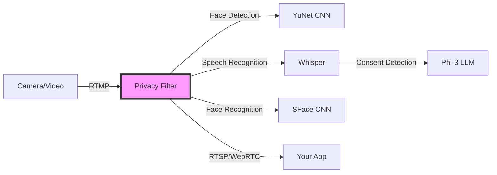

# 🛡️ Stream: Real-time Privacy Infrastructure for Smart Glasses

[](https://opensource.org/licenses/MIT)
[](https://www.python.org/)
[](https://www.typescriptlang.org/)

**Privacy-first video processing for the age of wearable cameras.** Build smart glasses apps without worrying about privacy compliance, consent management, or legal complexities.

## 🎯 The Problem

Smart glasses and wearable cameras are becoming mainstream, but developers face massive privacy hurdles:
- **Legal compliance** (GDPR, CCPA, state recording laws)
- **Consent management** for bystanders
- **Data deletion requests**
- **Public acceptance** and trust issues

## ✨ The Solution

Stream is a real-time privacy filter that sits between your camera and your app. It automatically:
- 🎭 **Blurs faces** of non-consenting individuals
- 🎤 **Detects verbal consent** ("I consent to be captured")
- 👤 **Remembers consented faces** using neural recognition
- ⚡ **Processes in real-time** (30fps on laptop CPU)
- 🔒 **Works offline** - no cloud dependencies

## 🎬 Demo

> **[Watch the demo video](#)** - See the privacy filter in action with real-time consent detection

<details>
<summary>📸 Screenshots</summary>

### Live Stream View
The main interface showing the privacy-filtered stream with face blurring active.

### Consent Management
Manage consented individuals with their captured images and timestamps.

### Recording Playback
Browse and replay privacy-protected recordings.

</details>

## 🚀 Quick Start

### Prerequisites
- Python 3.11+
- Node.js 18+
- [uv](https://docs.astral.sh/uv/) (Python package manager)
- [MediaMTX](https://github.com/bluenviron/mediamtx) (streaming server)

### 1. Clone and Setup

```bash
git clone https://github.com/PrivacyIsAllYouNeed/stream.git
cd stream

# Install Python dependencies
uv sync

# Download AI models
./scripts/download-models.sh  # Or manually:
# wget -P backend/filter https://github.com/opencv/opencv_zoo/raw/main/models/face_detection_yunet/face_detection_yunet_2023mar.onnx
# wget -P backend/filter https://github.com/opencv/opencv_zoo/raw/main/models/face_recognition_sface/face_recognition_sface_2021dec.onnx
# Download Phi-3.1 from HuggingFace
```

### 2. Start the Backend

```bash
# Terminal 1: Streaming server
mediamtx

# Terminal 2: Privacy filter
uv run backend/filter/main.py

# Terminal 3: Control API
uv run fastapi dev backend/api/main.py
```

### 3. Run the Example App

```bash
cd examples/rewind
npm install
npm run dev
# Open http://localhost:5173
```

### 4. Stream Your Video

```bash
# Stream a test video (replace with your camera feed)
ffmpeg -re -i your_video.mp4 -c:v libx264 -preset ultrafast \
  -f flv rtmp://127.0.0.1:1935/live/stream
```

## 🏗️ Architecture



### Core Components

| Component | Description | Tech Stack |
|-----------|-------------|------------|
| **Privacy Filter** | Real-time video processing pipeline | Python, FFmpeg, OpenCV |
| **Face Detection** | Identifies faces in video frames | YuNet neural network |
| **Face Recognition** | Matches consented individuals | SFace neural network |
| **Speech Processing** | Transcribes audio for consent | Faster Whisper, VAD |
| **Consent Detection** | Analyzes speech for consent phrases | Phi-3.1 Mini LLM |
| **Control API** | RESTful consent management | FastAPI |
| **Example App** | Reference implementation | React, TypeScript, Vite |

## 🎯 Key Features

### Real-time Processing
- **30 FPS** video processing on laptop CPU
- Non-blocking audio transcription with VAD
- Multi-threaded pipeline with queue-based communication
- Automatic backpressure handling

### Privacy Protection
- Automatic face blurring for non-consenting individuals
- Verbal consent detection ("I consent to be captured")
- Visual consent indicators (green labels for consented faces)
- File-based consent management with hot-reload

### Developer Friendly
- Drop-in replacement for raw camera feeds
- Standard RTMP input / RTSP output
- RESTful API for consent management
- WebRTC support for browser streaming
- Comprehensive example application

## 🔧 Configuration

Environment variables for customization:

```bash
# Input/Output
INPUT_URL=rtmp://127.0.0.1:1935/live/stream
OUTPUT_URL=rtsp://127.0.0.1:8554/filtered

# Performance
VIDEO_QUEUE_SIZE=30
AUDIO_QUEUE_SIZE=100
NUM_SPEECH_WORKERS=2

# Models
WHISPER_MODEL=base
LLM_MODEL=Phi-3.1-mini-4k-instruct-Q4_K_M.gguf
```

## 📚 Use Cases

- 🤖 **AI Assistants** - Build memory augmentation without privacy concerns
- 📹 **Social Apps** - Live streaming with automatic privacy protection
- 🏢 **Enterprise** - Workplace recording with compliance built-in
- 🎮 **AR/VR** - Mixed reality apps with bystander protection
- 📱 **Content Creation** - Automatic face blurring for vlogs

## 🛠️ Development

```bash
# Python (Backend)
uv run basedpyright        # Type checking
uv run ruff check --fix    # Linting
uv run ruff format         # Formatting

# TypeScript (Frontend)
npm run build              # Build production
npm run lint               # ESLint
```

## 🤝 Contributing

We welcome contributions! Areas we're focusing on:

- 🎯 Additional privacy filters (license plates, documents, screens)
- 🌍 Multi-language consent detection
- 📱 Mobile SDKs (iOS/Android)
- 🔊 Voice anonymization
- 📍 Location-based auto-shutoff
- ⚡ Performance optimizations

See [CONTRIBUTING.md](CONTRIBUTING.md) for guidelines.

## 📖 Documentation

- [Architecture Deep Dive](docs/architecture.md)
- [API Reference](docs/api.md)
- [Deployment Guide](docs/deployment.md)
- [Privacy Best Practices](docs/privacy.md)

## 🙏 Acknowledgments

Built with amazing open-source projects:
- [OpenCV](https://opencv.org/) - Computer vision
- [FFmpeg](https://ffmpeg.org/) - Media processing
- [Faster Whisper](https://github.com/guillaumekln/faster-whisper) - Speech recognition
- [MediaMTX](https://github.com/bluenviron/mediamtx) - Streaming server

## 📄 License

MIT License - see [LICENSE](LICENSE) for details.

---

<div align="center">

**🌟 If you find this useful, please star the repo! It helps others discover the project.**

[Report Bug](https://github.com/PrivacyIsAllYouNeed/stream/issues) · [Request Feature](https://github.com/PrivacyIsAllYouNeed/stream/issues) · [Join Discussion](https://github.com/PrivacyIsAllYouNeed/stream/discussions)

</div>