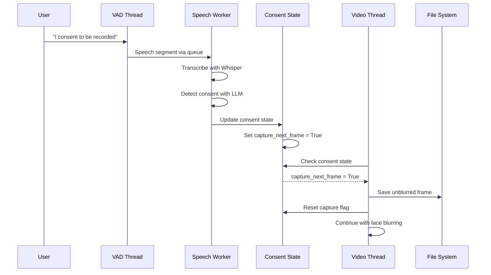

# Consent-Triggered Screenshot Capture Architecture

## Overview

This document describes the architecture for capturing unblurred video frames when explicit consent is detected through speech recognition. When a person says phrases like "I consent to be recorded", the system captures a single unblurred frame before face anonymization.

## System Flow



## Components

### 1. ConsentState (misc/state.py)

Thread-safe state management for consent tracking.

```python
class ConsentState:
    def __init__(self):
        self._lock = threading.Lock()
        self.has_consent: bool = False
        self.speaker_name: Optional[str] = None
        self.consent_timestamp: float = 0.0
        self.capture_next_frame: bool = False
```

**Key Methods:**
- `set_consent(name: Optional[str])` - Updates consent state and triggers capture
- `should_capture() -> bool` - Thread-safe check for capture flag
- `reset_capture()` - Clears the capture flag after screenshot

### 2. ScreenshotCapture (misc/screenshot.py)

Handles image file operations and naming.

```python
class ScreenshotCapture:
    SCREENSHOT_DIR = "screenshots"
    
    def save_frame(frame: np.ndarray, speaker_name: Optional[str]) -> str:
        # Generates filename: YYYYMMDD_HHMMSS_speakername.jpg
        # Returns: Full path to saved file
```

**Filename Format:**
- Pattern: `YYYYMMDD_HHMMSS_[speaker_name].jpg`
- Example: `20250107_143022_john_doe.jpg`
- No speaker: `20250107_143022_unknown.jpg`
- Underscore separators for easy parsing

### 3. Speech Worker Thread Updates (threads/speech_worker.py)

Detects consent and updates shared state.

```python
# In _process_segment method, after consent detection:
if consent_result and consent_result["has_consent"]:
    self.shared_state.consent_state.set_consent(consent_result.get("name"))
    logger.info(f"[CONSENT DETECTED] Individual: {consent_result.get('name', 'unknown')}")
```

### 4. Video Processing Thread Updates (threads/video.py)

Captures unblurred frames when consent is detected.

```python
def _process_frame(self, video_data: VideoData) -> ProcessedVideoData:
    # Check for consent-triggered capture
    if self.shared_state.consent_state.should_capture():
        try:
            screenshot_path = ScreenshotCapture.save_frame(
                video_data.frame,
                self.shared_state.consent_state.speaker_name
            )
            logger.info(f"Screenshot saved: {screenshot_path}")
            self.shared_state.consent_state.reset_capture()
        except Exception as e:
            logger.error(f"Failed to save screenshot: {e}")
    
    # Continue with normal processing
    processed_frame, faces_detected = self.face_detector.blur_faces_in_frame(
        video_data.frame
    )
    # ...
```

## Implementation Details

### Thread Safety

- All consent state access uses a `threading.Lock`
- Atomic flag operations prevent race conditions
- No blocking operations in critical sections

### Performance Considerations

- Single boolean check per frame (minimal overhead)
- Screenshot saving is fire-and-forget (no blocking)
- No additional queues or thread synchronization

### Error Handling

- Failed screenshots don't interrupt video processing
- Errors are logged but pipeline continues
- Directory creation handled automatically

### Storage

- Screenshots saved to `./screenshots/` directory
- Directory created automatically if missing
- JPEG format with quality=95 (good balance of quality/size)
- No automatic cleanup (files persist until manually removed)

## File Structure

```
filter/
├── misc/
│   ├── state.py          # [MODIFIED] Add ConsentState
│   └── screenshot.py     # [NEW] Screenshot utility
└── threads/
    ├── speech_worker.py  # [MODIFIED] Update consent state
    └── video.py          # [MODIFIED] Capture screenshots
```

## Usage Example

1. User says: "My name is Alice, I consent to be recorded"
2. System captures next unblurred frame
3. File saved as: `screenshots/20250107_143022_alice.jpg`
4. Face blurring continues for all subsequent frames

## Future Extensions

While not implemented in the initial version, the architecture supports:

- Multiple consent tracking (per-person consent)
- Consent expiration/revocation
- Metadata embedding in image EXIF
- Webhook notifications on capture
- Different capture triggers (gesture, QR code, etc.)

## Testing

To test the implementation:

1. Run the filter with test video containing faces
2. Speak consent phrase into microphone
3. Verify screenshot saved to `./screenshots/`
4. Confirm screenshot shows unblurred faces
5. Verify output stream continues with blurred faces